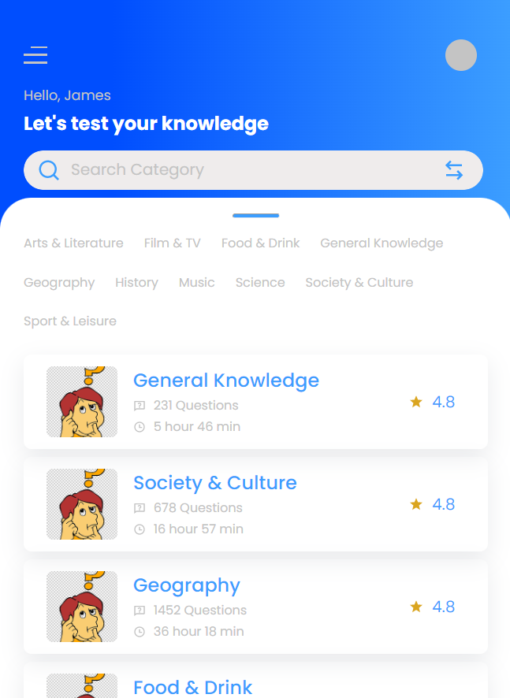

# Quiz App

This app is hosted on Netlify. You can either click here to visit the live link or host on your local machine.

### Desktop view


### Mobile view



## Hosting on Local Machine

```
git clone https://github.com/Maxwell-ihiaso/quiz-app.git
cd quiz-app
npm install && npm start
```

# API used - The Trivia API

The Trivia API - Free to use API for multiple choice trivia questions. Featuring procedurally generated and user generated questions.

[The Trivia APi](https://the-trivia-api.com/api/questions)

## UI Design Idea

[Quiz App Design (Community)](<https://www.figma.com/file/g0AjHva6kFJLzbe097bwlP/Quiz-App-Design-(Community)?node-id=0%3A1>)
